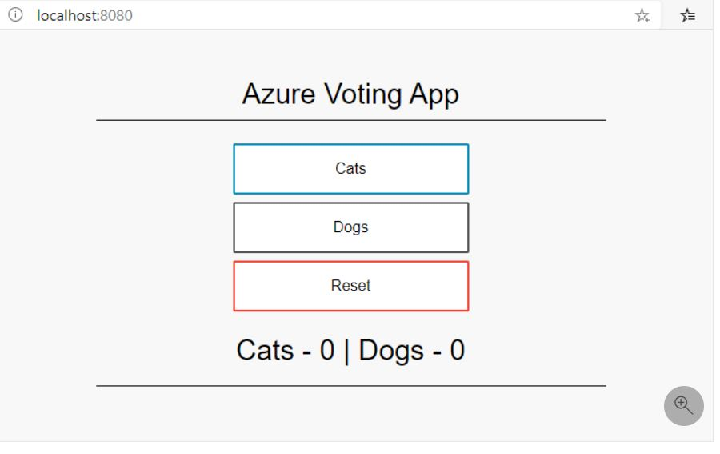
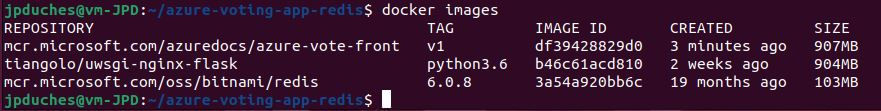
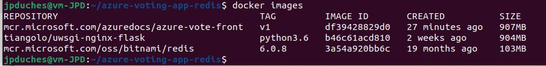
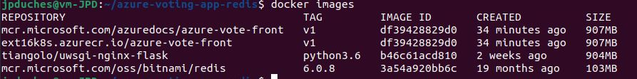

# Exercice 16 - Déployer une application sur AKS

Dans cet exercice, nous allons déploiyer une application sur notre cluster AKS.


## Etape 1 : Préparer une application pour Azure Kubernetes Service (AKS)

Dans ce tutoriel, première partie sur sept, une application multi-conteneurs est préparée pour être utilisée dans Kubernetes. Les outils de développement existants, tels que Docker Compose, sont utilisés pour construire et tester localement une application. 

Vous apprendrez à :
- Cloner la source d'un exemple d'application à partir de GitHub.
- Créer une image de conteneur à partir de la source de l'application type
- tester l'application multi-conteneurs dans un environnement Docker local.


Une fois terminé, l'application suivante s'exécute dans votre environnement de développement local :



Dans les tutoriels suivants, l'image du conteneur est téléchargée vers un registre de conteneurs Azure, puis déployée dans un cluster AKS.


### Obtenir le code de l'application

L'exemple d'application utilisé dans ce tutoriel est une application de vote de base composée d'un composant Web frontal et d'une instance Redis dorsale. Le composant web est empaqueté dans une image de conteneur personnalisée. L'instance Redis utilise une image non modifiée de Docker Hub.

Utilisez git pour cloner l'application d'exemple dans votre environnement de développement :

```bash
git clone https://github.com/Azure-Samples/azure-voting-app-redis.git
```

Passez dans le répertoire cloné.

```bash
cd azure-voting-app-redis
```

Le répertoire contient le code source de l'application, un fichier Docker compose précréé et un fichier manifeste Kubernetes. Ces fichiers sont utilisés tout au long de l'ensemble du tutoriel. Le contenu et la structure du répertoire sont les suivants :

```bash
azure-voting-app-redis
│   azure-vote-all-in-one-redis.yaml
│   docker-compose.yaml
│   LICENSE
│   README.md
│
├───azure-vote
│   │   app_init.supervisord.conf
│   │   Dockerfile
│   │   Dockerfile-for-app-service
│   │   sshd_config
│   │
│   └───azure-vote
│       │   config_file.cfg
│       │   main.py
│       │
│       ├───static
│       │       default.css
│       │
│       └───templates
│               index.html
│
└───jenkins-tutorial
        config-jenkins.sh
        deploy-jenkins-vm.sh
```

### Créer des images de conteneurs

Docker Compose peut être utilisé pour automatiser la création d'images de conteneurs et le déploiement d'applications multi-conteneurs.

Utilisez l'exemple de fichier docker-compose.yaml pour créer l'image du conteneur, télécharger l'image Redis et démarrer l'application :

```bash
docker-compose up -d
```
Une fois terminé, utilisez la commande docker images pour voir les images créées. Trois images ont été téléchargées ou créées. L'image azure-vote-front contient l'application frontale et utilise l'image nginx-flask comme base. L'image redis est utilisée pour démarrer une instance Redis.
```bashd
docker images
```



Exécutez la commande docker ps pour voir les conteneurs en cours d'exécution :

```bash
docker ps
```

### Tester l'application localement

Pour voir l'application en cours d'exécution, entrez http://localhost:8080 dans un navigateur web local. L'application d'exemple se charge, comme le montre l'exemple suivant :


### Nettoyer les ressources
Maintenant que la fonctionnalité de l'application a été validée, les conteneurs en cours d'exécution peuvent être arrêtés et supprimés. Ne supprimez pas les images de conteneur - dans le prochain tutoriel, l'image azure-vote-front est téléchargée vers une instance d'Azure Container Registry.

Arrêtez et supprimez les instances de conteneur et les ressources avec la commande docker-compose down :

```
docker-compose down
```

Lorsque l'application locale a été supprimée, vous disposez d'une image Docker qui contient l'application Azure Vote, azure-vote-front, à utiliser avec le prochain tutoriel.

## Etape 2 : Déployer et utiliser Azure Container Registry


Azure Container Registry (ACR) est un registre privé pour les images de conteneurs. Un registre de conteneurs privé vous permet de construire et de déployer vos applications et votre code personnalisé en toute sécurité. Dans ce tutoriel, deuxième partie sur sept, vous déployez une instance ACR et y poussez une image de conteneur. Vous apprendrez à :

- Créer une instance Azure Container Registry (ACR)
- Marquer une image de conteneur pour ACR
- Télécharger l'image vers ACR
- Afficher les images dans votre registre
- Dans les tutoriels suivants, cette instance ACR est intégrée à un cluster Kubernetes dans AKS, et une application est déployée à partir de l'image.

Créez une instance d'Azure Container Registry avec la commande **az acr create** et fournissez votre propre nom de registre. Le nom du registre doit être unique au sein d'Azure, et contenir 5 à 50 caractères alphanumériques. Dans le reste de ce tutoriel, <acrName> est utilisé comme caractère générique pour le nom du registre de conteneurs. Fournissez votre propre nom de registre unique. L'UGS de base est un point d'entrée optimisé en termes de coût à des fins de développement qui offre un équilibre entre le stockage et le débit.

```bash
az acr create \
    --name ext16k8s # J'ai utlisé un nom pour le registry faisant référence à l'exercice
    --resource-group myResourceGroup \
    --sku Basic
```

### Connectez-vous au registre des conteneurs

Pour utiliser l'instance ACR, vous devez d'abord vous connecter. Utilisez la commande az acr login et fournissez le nom unique donné au registre de conteneurs à l'étape précédente.

```bash
az acr login --name <acrName> 
```

### Marquer (Tag) une image de conteneur
Pour afficher une liste de vos images locales actuelles, utilisez la commande docker images :
```
docker images
```
La sortie de la commande ci-dessus montre la liste de vos images locales actuelles :



Pour utiliser l'image de conteneur azure-vote-front avec ACR, l'image doit être marquée avec l'adresse du serveur de connexion de votre registre. Cette étiquette est utilisée pour le routage lors de la transmission d'images de conteneur à un registre d'images.


Pour obtenir l'adresse du serveur de connexion, utilisez la commande az acr list et demandez le loginServer comme suit :

```
az acr list --resource-group myResourceGroup --query "[].{acrLoginServer:loginServer}" --output table
```
Maintenant, marquez votre image locale azure-vote-front avec l'adresse acrLoginServer du registre du conteneur. Pour indiquer la version de l'image, ajoutez :v1 à la fin du nom de l'image :

```
docker tag mcr.microsoft.com/azuredocs/azure-vote-front:v1 <acrLoginServer>/azure-vote-front:v1
```
Pour vérifier que les balises sont appliquées, exécutez à nouveau les images docker.

Une image est étiquetée avec l'adresse de l'instance ACR et un numéro de version.



### Pousser les images vers le registre

Avec votre image construite et étiquetée, poussez l'image azure-vote-front vers votre instance ACR. Utilisez docker push et fournissez votre propre adresse acrLoginServer pour le nom de l'image comme suit :

```
docker push <acrLoginServer>/azure-vote-front:v1
```
Cela peut prendre quelques minutes pour terminer le push de l'image vers ACR.

### Lister les images dans le registre

Pour renvoyer une liste des images qui ont été poussées vers votre instance ACR, utilisez la commande az acr repository list. Fournissez votre propre <acrName> comme suit :


```
az acr repository list --name <acrName> --output table
```
L'exemple de sortie suivant répertorie l'image azure-vote-front comme disponible dans le registre :


```
Result
----------------
azure-vote-front

```
Pour voir les balises d'une image spécifique, utilisez la commande az acr repository show-tags comme suit :

```
az acr repository show-tags --name <acrName> --repository azure-vote-front --output table
```

L'exemple de sortie suivant montre l'image v1 étiquetée à l'étape précédente :
```
Result
--------
v1
```

Vous avez maintenant une image de conteneur qui est stockée dans une instance privée d'Azure Container Registry. Cette image est déployée depuis ACR vers un cluster Kubernetes dans le prochain tutoriel.

## Etape 3 : Déployer un cluster Kubernetes

Cette étape à été fait dans l'exercice 15.

Par contre, vous devez faire la commande suivante pour intégrer votre ACR au cluster :

```bash
az aks update -n myAKSCluster -g myResourceGroup --attach-acr <acr-name>
```

## Etape 4 : Run applications in Azure Kubernetes Service (AKS)
Dans ce tutoriel, quatrième partie sur sept, un exemple d'application est déployé dans un cluster Kubernetes. Vous apprenez à :

Mettre à jour un fichier manifeste Kubernetes.
Exécuter une application dans Kubernetes
Tester l'application
Dans les tutoriels suivants, cette application est mise à l'échelle et mise à jour.

Démarrer votre cluster :

```bash
az aks start --name K8SExercice15 --resource-group 420-W45-SF-4392-Ex12-Matricule
```

### Mise à jour du fichier manifeste
Dans ces tutoriels, une instance Azure Container Registry (ACR) stocke l'image de conteneur pour l'application d'exemple. Pour déployer l'application, vous devez mettre à jour le nom de l'image dans le fichier manifeste Kubernetes pour inclure le nom du serveur de connexion ACR.

```bash
az acr list --resource-group myResourceGroup --query "[].{acrLoginServer:loginServer}" --output table
```
Vous avez récupéré cette information un peu plus haut.

L'exemple de fichier manifeste du repo git cloné dans le premier tutoriel utilise les images de Microsoft Container Registry (mcr.microsoft.com). Assurez-vous que vous êtes dans le répertoire cloné azure-voting-app-redis, puis ouvrez le fichier manifeste avec un éditeur de texte, tel que vi :


```bash
vi azure-vote-all-in-one-redis.yaml
```

Remplacez mcr.microsoft.com par le nom de votre serveur de connexion ACR. Le nom de l'image se trouve à la ligne 60 du fichier manifeste. L'exemple suivant montre le nom d'image par défaut :

```yaml
containers:
- name: azure-vote-front
  image: mcr.microsoft.com/azuredocs/azure-vote-front:v1
```
Fournissez votre propre nom de serveur de connexion ACR afin que votre fichier manifeste ressemble à l'exemple suivant :

```yaml
containers:
- name: azure-vote-front
  image: <acrName>.azurecr.io/azure-vote-front:v1
```

Enregistrez et fermez le fichier. Dans vi, utilisez :wq.

### Déployer l'application

Pour déployer votre application, utilisez la commande kubectl apply. Cette commande analyse le fichier manifeste et crée les objets Kubernetes définis. Spécifiez l'exemple de fichier manifeste, comme indiqué dans l'exemple suivant :

```bash
kubectl apply -f azure-vote-all-in-one-redis.yaml
```
L'exemple de sortie suivant montre les ressources créées avec succès dans le cluster AKS :

```
$ kubectl apply -f azure-vote-all-in-one-redis.yaml

deployment "azure-vote-back" created
service "azure-vote-back" created
deployment "azure-vote-front" created
service "azure-vote-front" created
```

### Tester l'application 
Lorsque l'application s'exécute, un service Kubernetes expose le frontal de l'application à Internet. Ce processus peut prendre quelques minutes pour se terminer.

Pour surveiller la progression, utilisez la commande kubectl get service avec l'argument --watch.

```
kubectl get service azure-vote-front --watch
```
Initialement, l'EXTERNAL-IP pour le service azure-vote-front est affiché comme étant en attente (pending):

```
azure-vote-front   LoadBalancer   10.0.34.242   <pending>     80:30676/TCP   5s
```
Lorsque l'adresse EXTERNAL-IP passe d'une adresse en attente à une adresse IP publique réelle, utilisez CTRL-C pour arrêter le processus de surveillance kubectl. L'exemple de sortie suivant montre une adresse IP publique valide attribuée au service :

```
azure-vote-front   LoadBalancer   10.0.34.242   52.179.23.131   80:30676/TCP   67s
```
Faite une capture pour la remise

Pour voir l'application en action, ouvrez un navigateur web sur l'adresse IP externe de votre service :


Faite une capture pour la remise

Si l'application ne s'est pas chargée, cela peut être dû à un problème d'autorisation avec votre registre d'images. Pour afficher l'état de vos conteneurs, utilisez la commande kubectl get pods. Si les images de conteneurs ne peuvent pas être tirées, consultez la section Authentification avec le registre de conteneurs Azure à partir du service Azure Kubernetes.


# Remise

Déposer les deux images capturé dans un seule fichier que vous déposer sur LÉA comme preuve de réalisation de l'exercice.

Conserver v
## Arrêter et démarrer un cluster Azure Kubernetes Service (AKS)


```bash
az aks stop --name K8SExercice15 --resource-group 420-W45-SF-4392-Ex12-Matricule
```

Vous pouvez vérifier que votre cluster est arrêté en utilisant la commande az aks show et en confirmant que le powerState indique Stopped comme dans la sortie ci-dessous :

```json
{
[...]
  "nodeResourceGroup": "MC_myResourceGroup_myAKSCluster_westus2",
  "powerState":{
    "code":"Stopped"
  },
  "privateFqdn": null,
  "provisioningState": "Succeeded",
  "resourceGroup": "myResourceGroup",
[...]
}

```


<hr>


## Source :
- Tutoriel :  https://docs.microsoft.com/en-us/azure/aks/tutorial-kubernetes-prepare-app


